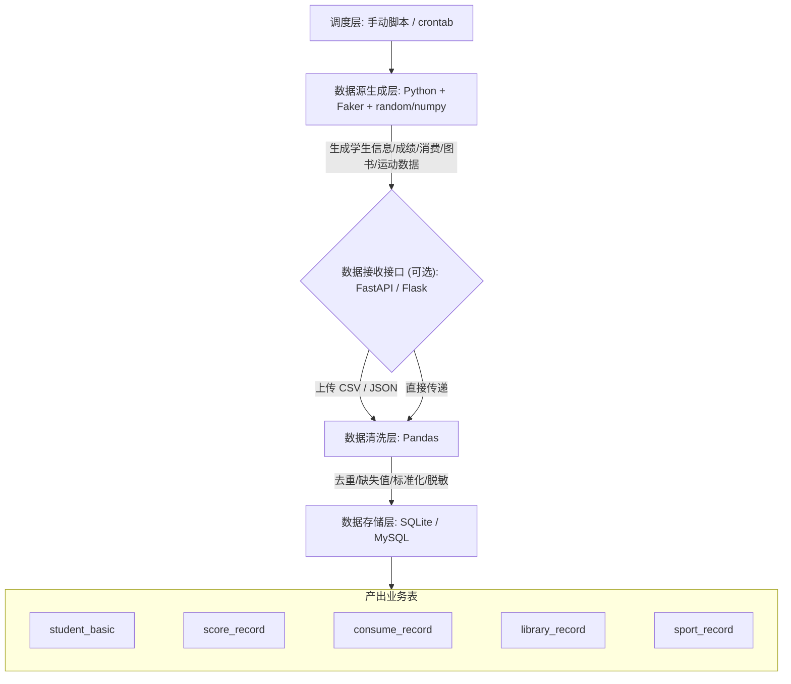

```mermaid
graph TD;
    A["调度层: 手动脚本 / crontab"] --> B["数据源生成层: Python + Faker + random/numpy"]
    B -->|"生成学生信息/成绩/消费/图书/运动数据"| C{"数据接收接口 (可选): FastAPI / Flask"}
    C -->|"上传 CSV / JSON"| D["数据清洗层: Pandas"]
    C -->|"直接传递"| D
    D -->|"去重/缺失值/标准化/脱敏"| E["数据存储层: SQLite / MySQL"]

    %% 关键：将主流程最后一步连向子图，让它自动排在下面
    E --> OutputGroup

    %% 定义子图，并设置内部横向排列
    subgraph OutputGroup ["产出业务表"]
        direction LR
        F1["student_basic"]
        F2["score_record"]
        F3["consume_record"]
        F4["library_record"]
        F5["sport_record"]
    end

    %% 如果你希望子图里的表看起来是有序或有关联的，可以加上虚线辅助布局
    F1 ~~~ F2 ~~~ F3 ~~~ F4 ~~~ F5
```